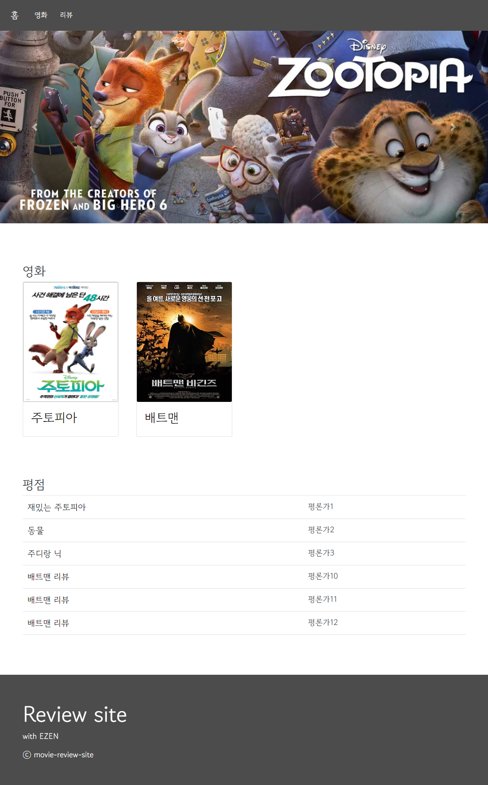
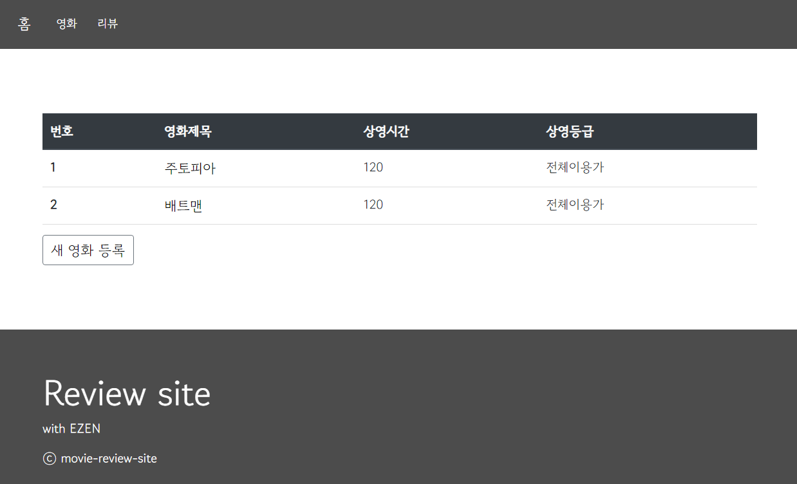
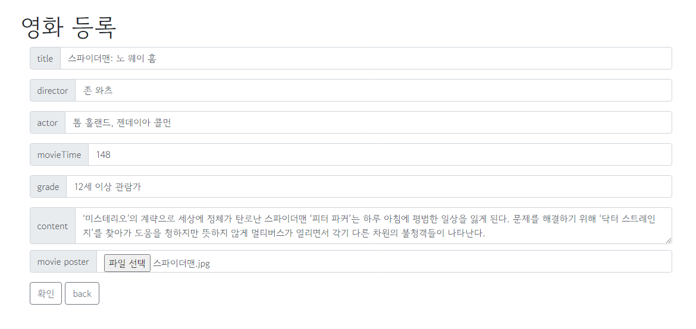
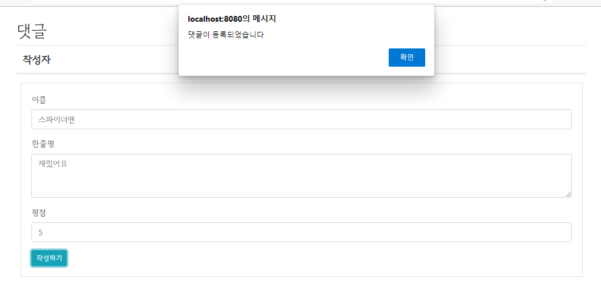
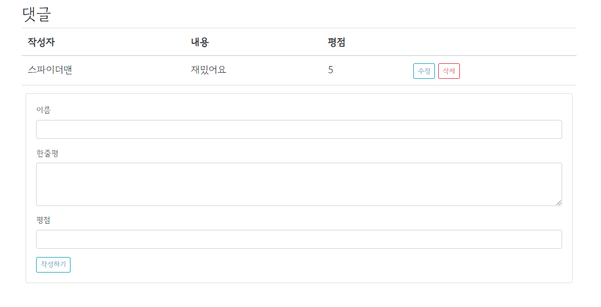
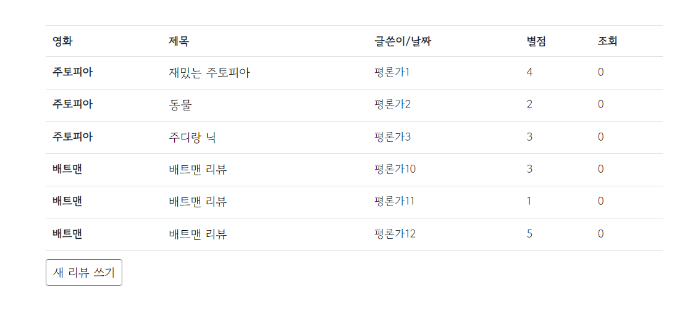
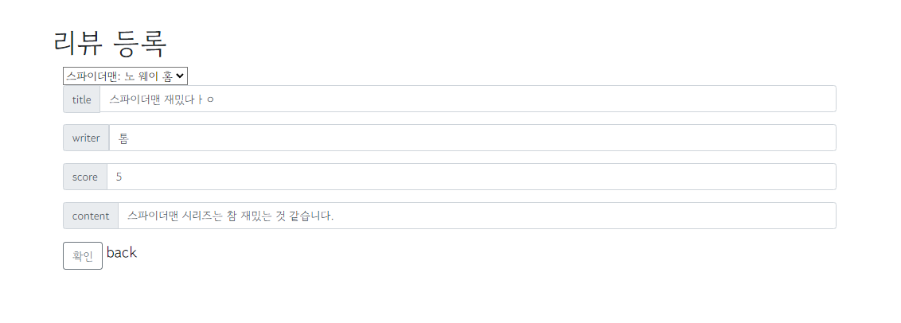
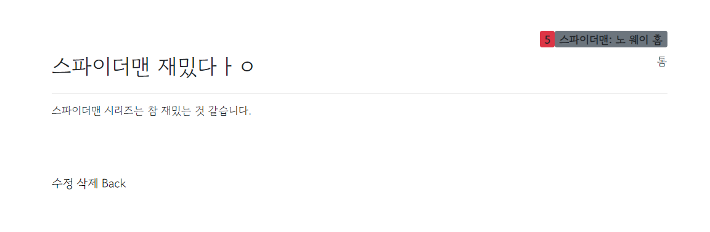

# Movie-Review-Site
팀프로젝트_SpringBoot 로 구현하는 영화 리뷰 사이트 입니다.   

[구현 과정 보기😋](https://gallery-k.tistory.com/category/%EC%BB%B4%ED%93%A8%ED%84%B0/%EC%9B%B9%20%EA%B0%9C%EB%B0%9C_%ED%8C%80%ED%94%8C)

## 페이지 설계

영화 페이지에서는 영화 제목, 영화 이미지, 영화 정보, 영화 평점 등을 볼 수 있습니다.   
영화 상세 페이지에서는 영화의 평가를 댓글 형식으로 남길 수 있습니다.   
리뷰 페이지에서는 영화의 리뷰를 작성할 수 있습니다.   

[comment]: <> (## DB 설계)

## 개발 도구

Front-end:
- Mustache, Bootstrap, jQuery

Back-end:
- SpringBoot, JPA, CRUD, MVC

DB: 
- H2

[comment]: <> (- MySQL)

[comment]: <> (## 업무 분담)

## view

---

### 메인 페이지   
메인 페이지에서는 등록된 영화와, 영화의 리뷰를 볼 수 있습니다.   

### 영화 페이지   
nav 바의 '영화' 를 클릭하면 영화 페이지로 이동합니다.   

- 영화 등록 페이지   

영화를 등록할 수 있는 페이지 입니다.   
영화를 등록하면 영화 상세 페이지로 리다이렉트 됩니다.

- 영화 상세 페이지   

영화 페이지의 '영화이름' 을 클릭하면 영화 상세 페이지로 이동합니다.   
영화 페이지에서는 영화 제목, 영화 이미지, 영화 정보, 영화 평점 등을 볼 수 있습니다.   
영화 페이지에서는 영화의 감상평을 작성할 수 있습니다.   

   

영화의 감상평은 수정, 삭제가 가능합니다.

### 리뷰 페이지    

nav 바의 '리뷰' 를 클릭하면 리뷰 페이지로 이동합니다.   
리뷰 페이지에서는 영화의 리뷰를 볼 수 있습니다.   

- 리뷰 등록 페이지   

리뷰를 등록할 수 있는 페이지 입니다.   
리뷰를 등록하면 리뷰 페이지로 리다이렉트 됩니다.

- 리뷰 상세 페이지

리뷰 페이지의 '리뷰이름' 을 클릭하면 리뷰 상세 페이지로 이동합니다.   

'수정' 을 누르면 리뷰를 수정할 수 있습니다.   
'삭제' 를 누르면 리뷰를 삭제할 수 있습니다.
